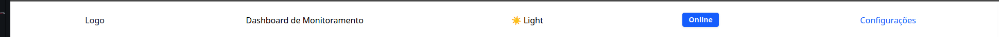
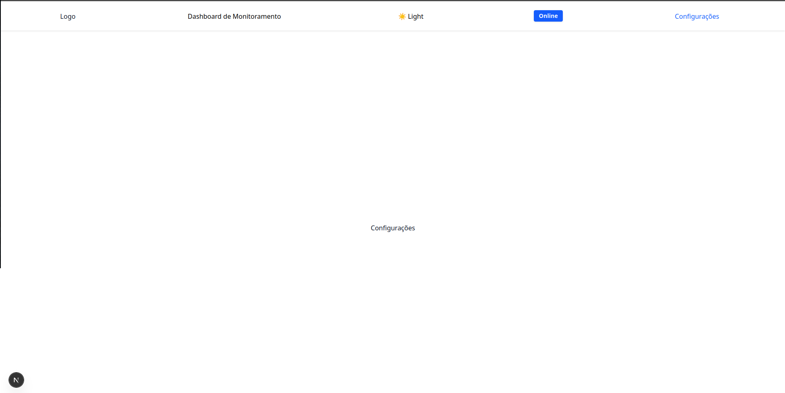
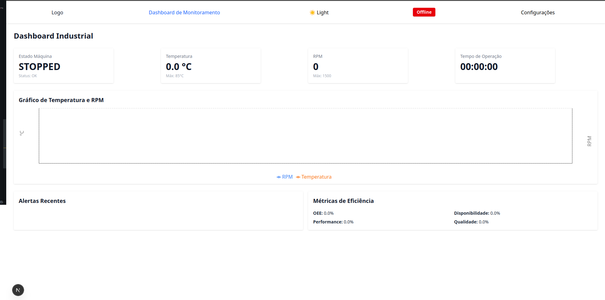
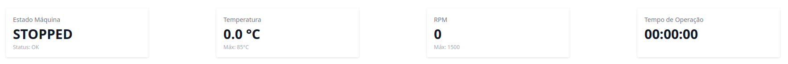
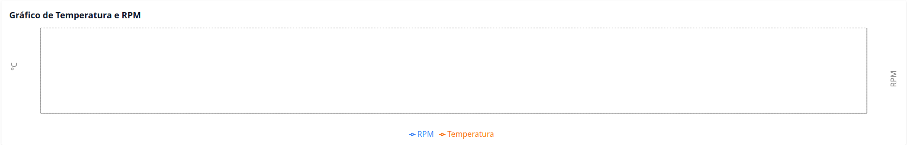
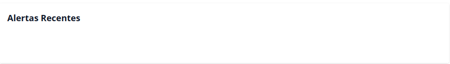
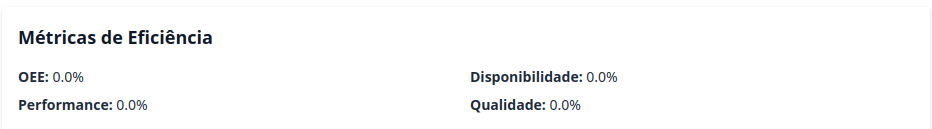

# 🚀 Dashboard de Monitoramento Industrial

## 🔧 Instalação

```bash
# Instale as dependências raiz
npm install
```

```bash
# Rode o app web
npm run dev --filter=web
```

## 📄 Popular Base de Dados

- Entrar em

```bash
  cd /packages/db
```

- Rodar o comando

```bash
  npm run seed
```

## 📊 Visão Geral

Esse projeto é um **dashboard industrial em tempo real**, desenvolvido para monitorar o estado de uma máquina de produção misturador. Utiliza **Next.js (App Router) com TypeScript**, **Tailwind CSS** para estilização, **Turborepo** como arquitetura monorepo e **componentes reutilizáveis** compartilhados via pacotes.

## 🎯 Objetivo

Criar uma solução **modular e escalável** com:

- Dados em tempo real (simulados a cada 2-5s)
- Indicadores de máquina (status, temperatura, RPM, uptime)
- Sistema de alertas com níveis INFO, WARNING, CRITICAL
- Métricas OEE: Disponibilidade, Performance, Qualidade
- Gráficos e visualizações modernas
- Componentes reutilizáveis e separados por responsabilidade

## 🧱 Estrutura Monorepo

```txt
desafio-stw/
├── apps/
│   └── web/                 # Frontend Next.js (App Router)
│       ├── app/             # Páginas e layouts
│       ├── components/      # Componentes reutilizáveis
│       ├── hooks/           # Hooks customizados
│       ├── provider/        # Providers globais (ex: conexão, tema)
│       ├── public/          # Assets públicos (ex: sons)
│       ├── utils/           # Funções auxiliares
│       └── tailwind.config.ts
├── packages/
│   ├── db/                  # Base de dados (SQLite ou Prisma)
│   ├── types/               # Tipos e interfaces TypeScript compartilhadas
│   ├── typescript-config/   # Configuração TS global
│   ├── eslint-config/       # Regras de lint compartilhadas
│   └── ui/                  # Componentes visuais compartilhados (futuramente)
├── turbo.json               # Pipeline do Turborepo
└── package.json
```

## 📦 Tecnologias

#### Ferramenta Descrição

- Next.js 14+ Framework React
- TypeScript Tipagem estática
- Tailwind CSS Estilização utilitária
- Turborepo Gerenciador de monorepo
- Recharts Gráficos interativos
- SQLite Banco de dados leve (mock)
- [ESLint + Prettier] Padronização e qualidade de código

## Estrutura de Dados

```ts
interface MachineStatus {
  id: string;
  timestamp: Date;
  state: "RUNNING" | "STOPPED" | "MAINTENANCE" | "ERROR";
  metrics: {
    temperature: number;
    rpm: number;
    uptime: number;
    efficiency: number;
  };
  oee: {
    overall: number;
    availability: number;
    performance: number;
    quality: number;
  };
}

interface Alert {
  id: string;
  level: "INFO" | "WARNING" | "CRITICAL";
  message: string;
  component: string;
  timestamp: Date;
  acknowledged: boolean;
}

interface MetricHistory {
  timestamp: Date;
  temperature: number;
  rpm: number;
  efficiency: number;
}
```

## 🧩 Funcionalidades

#### Monitoramento em Tempo Real

- Dados atualizados a cada 2–5 segundos
- Simulação com setInterval e faker
- Estados: RUNNING, STOPPED, MAINTENANCE, ERROR

#### Visualização

- Cards com indicadores: temperatura, RPM, uptime
- Gráficos de linha com histórico
- Métricas OEE: disponibilidade, performance, qualidade

#### Alertas

- Prioridade: CRITICAL > WARNING > INFO
- Modal sonoro para alertas críticos (playAlertSound.ts)
- Lista com destaque por severidade

#### Extras

- Modo Dark/Light com toggle persistente
- Status de conexão com feedback visual
- Interface responsiva (desktop, tablet e mobile)

## 📄 Documentação Técnica

- Estrutura de pastas pensada para escalar
- components/templates/ para agrupamento
- hooks/ para encapsular lógicas de dados
- provider/ para contexto global como conexão e tema
- types/ compartilhado entre pacotes e apps
- utils/ para funcionalidades avulsas (ex: tocar som)

## Decisões Técnicas

- Turborepo para escalar para múltiplas apps (ex: web, admin, api)
- Tailwind para flexibilidade e responsividade rápida
- TypeScript rigoroso em todos os domínios
- Gráficos com Recharts por simplicidade e documentação

## 📽️ Demonstração

### Header



- Navegação entre os componentes de Dashboard de Monitoramento e Configurações
- Status de máquina online ou offline de acordo com a conexão wi-fi
- Botão de tema Light ou Dark

### Tela Configurações



### Tela Dashboard de Monitoramento



### Estados da Máquina



### Gráfico em Tempo Real



### Histórico de Alertas Recentes



### Métricas de Eficiência



### Vídeo

<video controls src="screentShotsAndVideos/v.mp4" title="Title"></video>
